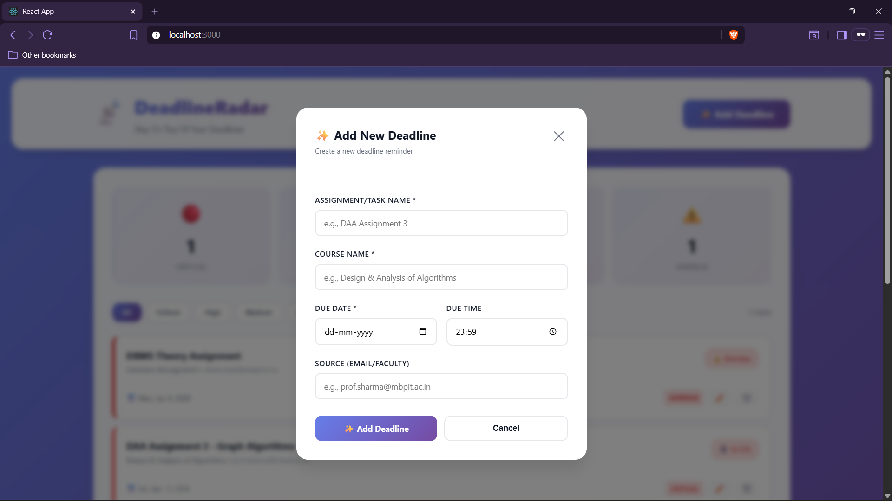

# 📡 DeadlineRadar

### *Track smarter. Never miss a deadline.*

[](https://your-deployment-url.example.com)
[](https://react.dev)
[](https://developer.mozilla.org/en-US/docs/Web/API/Window/localStorage)
[](https://github.com/nadeem12-cloud)

> **A sleek React deadline dashboard — select your courses, add tasks, get AI-powered prioritization with live countdowns.**

[🚀 Live App](https://your-deployment-url.example.com) · [📓 Source Code](https://github.com/nadeem12-cloud/Deadline_Radar) · [👤 Portfolio](https://nadeem12-cloud.github.io/Portfolio/)

---

## 📸 Screenshots

| Dashboard | Add Deadline Modal |
|:---------:|:-----------------:|
|  |  |

| Priority Filters | Empty State |
|:---------------:|:----------:|
|  |  |

---

## ✨ Features

| | Feature | Description |
|--|---------|-------------|
| ✅ | **Full CRUD Operations** | Add, edit, delete deadlines with instant UI updates |
| 🎯 | **Auto-Priority Assignment** | Critical → High → Medium → Low → Overdue (smart ranking) |
| ⏱️ | **Live Countdown Timers** | Real-time updates every 30s — see exactly how much time remains |
| 💾 | **Persistent Storage** | localStorage keeps your data safe — no backend needed |
| 🔍 | **Smart Filtering** | View by priority, course, or all deadlines at once |
| 🔔 | **24-Hour Alerts** | Toast notifications when deadlines are within 24 hours |
| 📊 | **Stats Dashboard** | Quick-glance cards showing task counts per priority |
| 🎨 | **Glassmorphism UI** | Modern, responsive design with smooth animations |

---

## 🤖 How Prioritization Works

```
Deadline Input (task + due date)
            ↓
    Calculate Time Remaining
  ┌──────────────────────────────┐
  │  < 0 hours?  → OVERDUE       │
  │  0–6 hours?  → CRITICAL      │
  │  6–24 hours? → HIGH          │
  │  1–3 days?   → MEDIUM        │
  │  3+ days?    → LOW           │
  └──────────────────────────────┘
            ↓
    Auto-Sort by Priority
            ↓
    Display with Color Badges
```

### 📈 User Experience

| Metric | Benefit |
|--------|---------|
| ⚡ **Instant Feedback** | Changes appear immediately — no page reload |
| 🎯 **Zero Distraction** | Only see what matters — critical tasks first |
| 📱 **Mobile-First** | Works perfectly on phone, tablet, desktop |
| 🔒 **Privacy First** | All data stays in your browser — no cloud required |

---

## 🛠️ Tech Stack

| Layer | Technology |
|-------|------------|
| 🎨 Frontend | React 19 + React Hooks |
| 🎭 Styling | Modern CSS (glassmorphism, CSS variables) |
| 💾 Storage | localStorage (browser-based) |
| ⚙️ Tooling | Create React App, npm |
| ☁️ Deployment | Vercel / Netlify |

---

## 📁 Project Structure

```
deadline-radar/
│
├── 📄 public/
│   └── index.html               ← HTML entry point
│
├── 📄 src/
│   ├── App.js                   ← Main component (state + logic)
│   ├── App.css                  ← Glassmorphism styling
│   ├── index.js                 ← React render
│   ├── index.css                ← Global styles
│   └── deadline-radar.jsx       ← Optional component reference
│
├── 📂 assets/
│   ├── dashboard.png            ← Screenshots
│   ├── modal.png
│   ├── filters.png
│   └── empty.png
│
├── 📄 package.json
├── 📄 README.md
└── 📄 .gitignore
```

---

## ⚡ Quick Start

### Prerequisites

- **Node.js 14+** and **npm**

### Installation

```bash
# Clone the repository
git clone https://github.com/yourusername/deadline-radar.git
cd deadline-radar

# Install dependencies
npm install

# Start the dev server
npm start
```

Open [http://localhost:3000](http://localhost:3000) in your browser.

The app will auto-reload on file changes. Try adding a deadline — it persists instantly to localStorage!

---

## 📖 Usage Guide

### ➕ Add a Deadline

1. Click the **✨ Add Deadline** button
2. Fill in:
   - **Task Name** (e.g., "Math Assignment 5")
   - **Course** (e.g., "Calculus 101")
   - **Due Date & Time** (optional — defaults to today)
   - **Source** (optional — e.g., "Canvas", "Email")
3. Click **Submit** — task appears in your list

### ✏️ Edit or Delete

- Click **✏️** on any task to edit (opens modal with pre-filled data)
- Click **🗑️** to delete instantly

### 🔍 Filter & View

- Use priority buttons: **All** | **Critical** | **High** | **Medium** | **Low** | **Overdue**
- Stats cards at the top show counts per priority
- Tasks auto-sort by urgency

---

## 🎨 Customization

### Change Colors

Edit CSS variables in `src/App.css`:

```css
:root {
  --primary-color: #3B82F6;        /* Main blue */
  --accent: #8B5CF6;               /* Purple accent */
  --critical: #EF4444;             /* Red for urgent */
  --bg-gradient-from: #667eea;
  --bg-gradient-to: #764ba2;
  --text-light: #F3F4F6;
  --text-dark: #1F2937;
}
```

### Adjust Alert Threshold

In `src/App.js`, find the notification logic:

```js
// Default: 24 hours (24 * 3600000 ms)
const ALERT_THRESHOLD = 24 * 3600000;

if (!d.notified && diff > 0 && diff < ALERT_THRESHOLD) {
  // Show toast notification
}
```

Change `24` to any number of hours you prefer.

---

## 🚀 Deployment

### Deploy to Vercel (Recommended)

```bash
# Install Vercel CLI globally
npm i -g vercel

# Deploy (Vercel auto-detects CRA)
vercel
```

Follow the prompts — your app goes live in seconds.

### Deploy to Netlify

```bash
# Build the app
npm run build

# Option 1: Drag & drop the 'build/' folder to Netlify.com

# Option 2: Use CLI
npm i -g netlify-cli
netlify deploy --prod --dir=build
```

---

## 💾 Data Backup & Export

### Manual Backup

1. Open **DevTools** (F12) → **Console**
2. Run:

```js
copy(localStorage.getItem('deadlines'))
```

3. Paste into a `.json` file to save

### Restore from Backup

```js
localStorage.setItem('deadlines', YOUR_JSON_HERE)
location.reload()
```

> Future versions will include one-click export/import and cloud sync!

---

## 🗓️ Roadmap

| Version | Features |
|---------|----------|
| **v1.0** | Core CRUD, priority ranking, localStorage *(current)* |
| **v1.1** | Export/import, unit tests, accessibility audit |
| **v2.0** | Gmail integration, calendar view, recurring tasks |
| **v3.0** | Cloud sync, user accounts, team collaboration |
| **v4.0** | Mobile app, push notifications, AI course parsing |

---

## 🛠️ Development

### Run Tests

```bash
npm test
```

### Build for Production

```bash
npm run build
```

Creates an optimized `build/` folder ready for deployment.

### Code Structure Tips

- **State Management**: All deadlines stored in `App.js` state
- **Reusable Components**: Break modals, cards, filters into separate `.jsx` files
- **localStorage Sync**: Use `useEffect` to persist state on every change
- **Performance**: Memoize components with `React.memo()` if needed

---

## ⚠️ Limitations & Future Work

- **Manual Updates**: Form sliders require manual input before each session
- **No Weather/Alerts**: Doesn't account for external disruptions
- **Browser-Only**: Data doesn't sync across devices (v2.0 will fix this)
- **No Recurring Tasks**: Each deadline is one-time (planned for v2.0)

---

## 🤝 Contributing

Contributions welcome! Here's how:

1. **Fork** the repository
2. **Create a branch**: `git checkout -b feature/my-feature`
3. **Commit changes**: `git commit -m "Add my feature"`
4. **Push**: `git push origin feature/my-feature`
5. **Open a Pull Request** with a clear description

For UI changes, please include screenshots or GIFs.

---

## 📄 License

MIT License — feel free to reuse and adapt for your portfolio or personal projects.

---

## 👤 About

Built with care for students juggling multiple deadlines across courses, exams, and projects.

### Highlight in Your Portfolio

- **UI/UX Design**: Glassmorphism theme, smooth animations, responsive layout
- **State Management**: React Hooks for clean, functional component logic
- **Data Persistence**: localStorage strategy with backup/restore capability
- **Scalability**: Architecture ready for cloud sync and user accounts (v2.0)

---

<div align="center">

**Mohamad Nadeem**

[](https://github.com/nadeem12-cloud)
[](www.linkedin.com/in/nadeemmemon10)
[](https://nadeem12-cloud.github.io/Portfolio/)

*Built for students. Designed for simplicity. Ready to scale.*

**📡 Never miss another deadline.**

</div>
